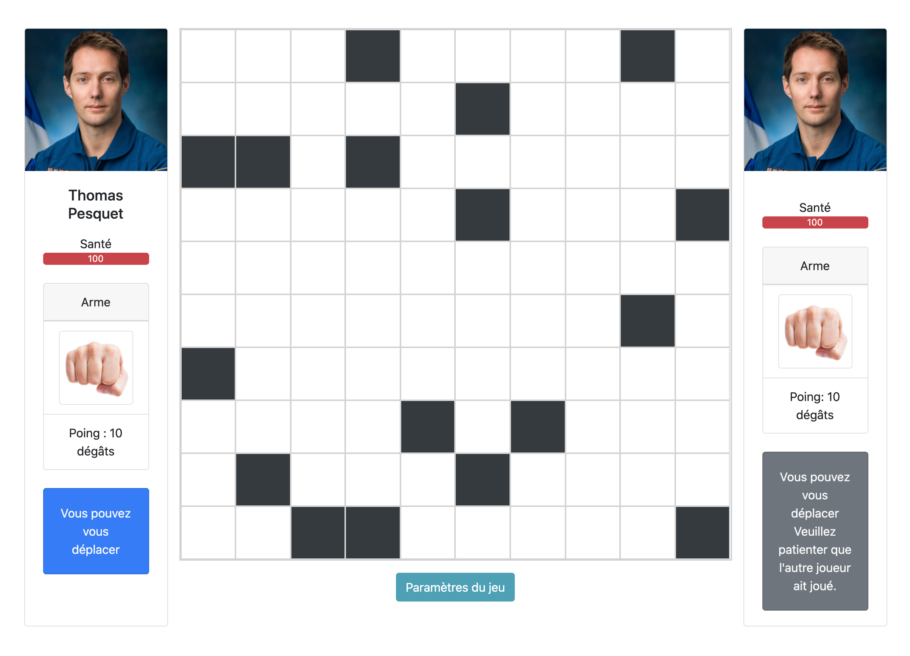
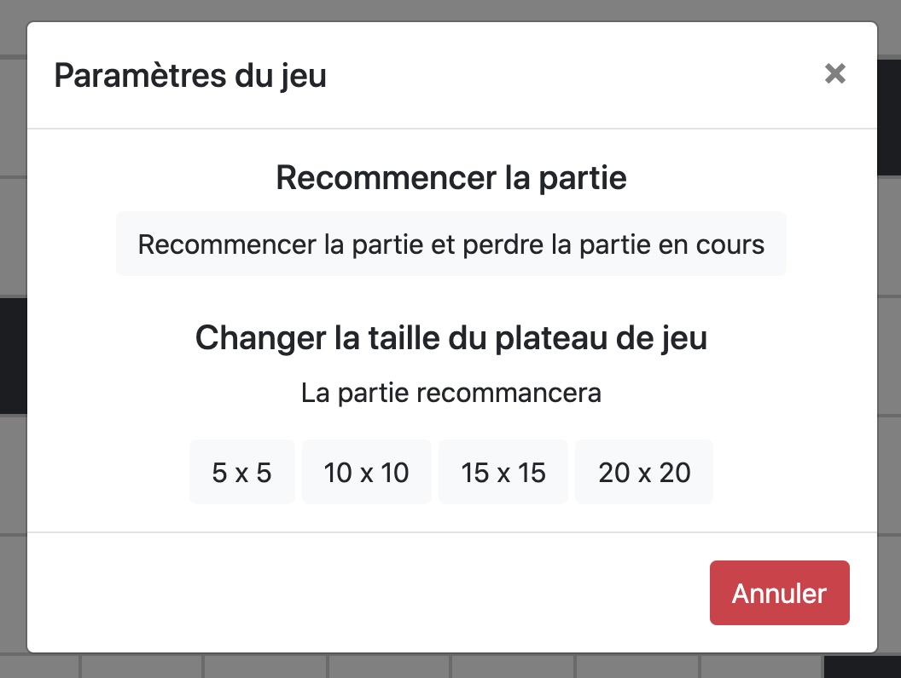

# Jeu de plateau réalisé dans le cadre de ma formation avec Openclassrooms

Projet arrêté en cours pour :

- Me concentrer sur des projets avec des technologies que je maîtrisai moins alors (React, Vue).
- Mieux utiliser mon temps et apprendre plein de nouvelles choses !
- Ne plus passer trop de temps sur des technologies que je maîtrise (Node, templates EJS, JavaScript).

Vous pouvez regarder le repo pour voir un peu comment je me débrouille avec Node. 😊

Vous pouvez changer la taille du _jeu de plateau_ dynamiquement.
